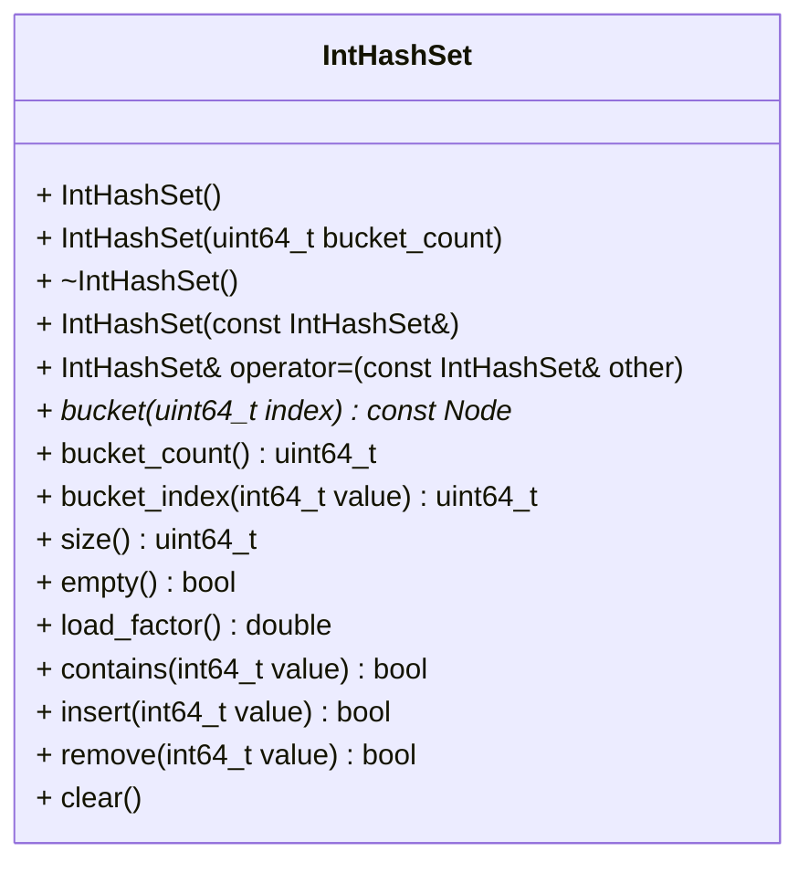

# Hash Set for Integers (`int64_t`)

A hash set for storing integers is to be created. A hash set stores every
value at most once and allows to insert, find and remove values in $O(1)$
time on average. The set uses an array of buckets. Every bucket is a singly
linked list that stores all values belonging to this bucket. The index of the
bucket a value belongs to is computed by a hash function. Both the array of
buckets and every node must be allocated on the heap. Using containers of the
standard library (e.g. `std::vector`, `std::list` or `std::unordered_set`)
for storing the elements is not allowed.

This repository contains a `CMakeLists.txt` file that is already sufficient
for the project. It also contains some automated tests that provide feedback
on your progress. To receive full points, the following API must be declared
in `int_hash_set.hpp`. Its implementation must be realized in
`int_hash_set.cpp`. You have to correctly declare the member functions'
`const`-ness in order to allow the provided auto-tests to compile. Place all
your declarations and definitions inside the appropriate namespace (the
namespace name must match the namespace used in the provided test cases).

After finishing the below tasks, run the following commands to see if your code
is correct. Note that a current version of `libcatch` has to be installed
to compile.

```shell
mkdir build && cd build
cmake ..
make -j4
./int_hash_set_test
```

The following class diagram gives an overview of the required API.



In addition to the class, implement the following operator as non-member.

```cpp
std::ostream& operator<<(std::ostream& os, const ds::IntHashSet& set);
```

## Hash Function
The index of the bucket a value $v$ belongs to is the non-negative remainder
of the division of $v$ by the number of buckets $n$:

$$
\text{index}(v) = v \bmod n, \quad 0 \le \text{index}(v) < n
$$

Note that the operator `%` of C++ returns a negative result for negative
values (e.g. `-1 % 10 == -1`), whereas the index has to be `9` in this case.
Examples for `10` buckets: `13` belongs to bucket `3`, `-1` to bucket `9` and
`-13` to bucket `7`.

New values are added to the front of the list of their bucket (like
`push_front` of a singly linked list).

## Rehashing
The load factor of the set is the average number of values per bucket:

$$
\text{load factor} = \frac{\text{size}}{\text{bucket count}}
$$

The longer the lists get, the slower the set becomes. Therefore, whenever the
load factor exceeds `0.75` after inserting a value, the number of buckets has
to be doubled and all values have to be moved into the new buckets
(rehashing). Example: a set with `8` buckets is rehashed to `16` buckets when
the 7th value is inserted ($7 / 8 = 0.875 > 0.75$). The order of the values
inside a bucket after rehashing is not specified. Removing values never
reduces the number of buckets.

## Required behavior
`IntHashSet()` create an empty set with `8` buckets  
`IntHashSet(uint64_t bucket_count)` create an empty set with `bucket_count`
  buckets; throw an exception if `bucket_count` is `0`  
`~IntHashSet()` free all heap-allocated resources (all nodes and the array
  of buckets)  
`IntHashSet(const IntHashSet&)` create an independent copy with the same
  number of buckets and the same values  
`IntHashSet& operator=(const IntHashSet& other)` replace the content (and
  the number of buckets) with an independent copy of `other`; self-assignment
  (`set = set`) must leave the set unchanged  

`const Node* bucket(uint64_t index)` return pointer to immutable first
  element of the bucket with the given `index` (for testing); throw an
  exception if `index` is out of bounds  
`uint64_t bucket_count()` return the number of buckets  
`uint64_t bucket_index(int64_t value)` return the index of the bucket
  `value` belongs to (see hash function)  
`uint64_t size()` return the number of values in the set  
`bool empty()` return `true` if the set is empty, `false` otherwise  
`double load_factor()` return the current load factor  
`bool contains(int64_t value)` return `true` if `value` is stored in the
  set, `false` otherwise  

`bool insert(int64_t value)` add `value` to the front of its bucket and
  rehash if necessary; return `false` and leave the set unchanged if `value`
  is already stored  
`bool remove(int64_t value)` remove `value`; return `true` if it was found
  and removed, `false` otherwise  
`void clear()` remove all values; the number of buckets stays the same  

`std::ostream& operator<<(std::ostream& os, const IntHashSet& set)` print all
values bucket by bucket (ascending index) and inside a bucket from the first
to the last element; e.g. a set with `4` buckets prints `hs[5, 1, 2]` after
`insert(1)`, `insert(5)` and `insert(2)`; an empty set is printed as `hs[]`

The implementation of the set may, of course, use additional private 
member functions.


# Grading
This task will primarily be graded using autotests. You also need
to maintain a consistent coding style. In particular, all identifiers and
comments have to be in English!
